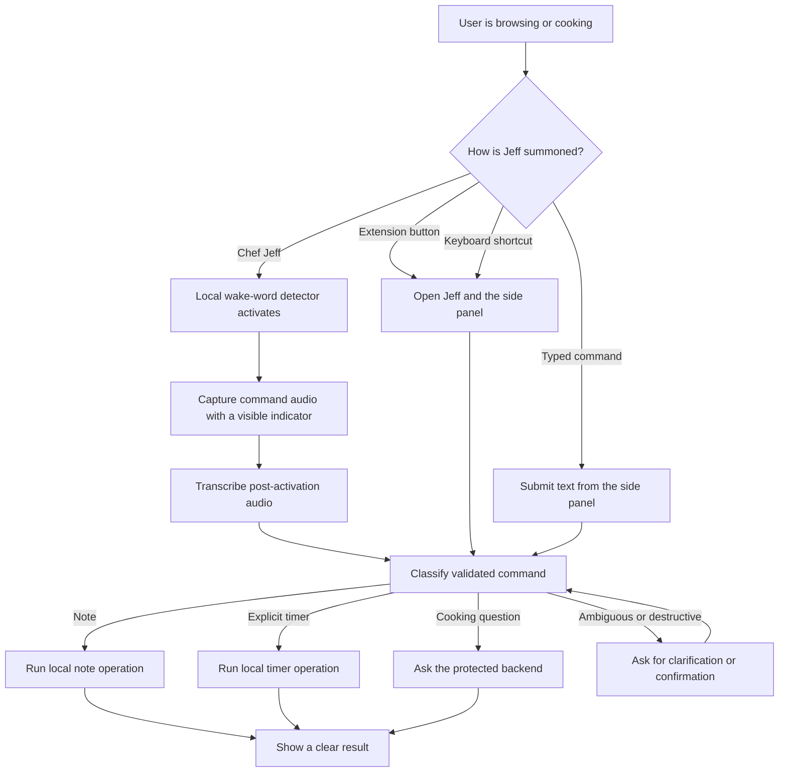
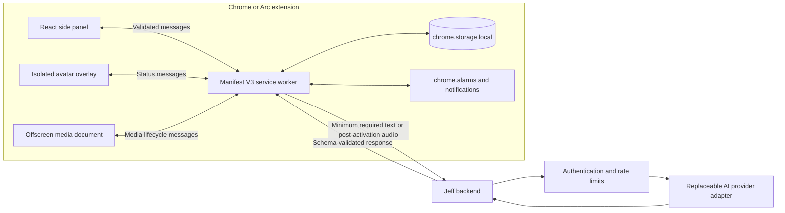
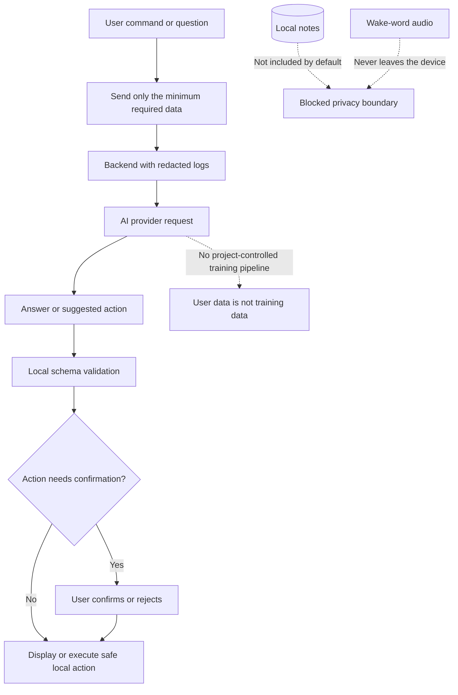
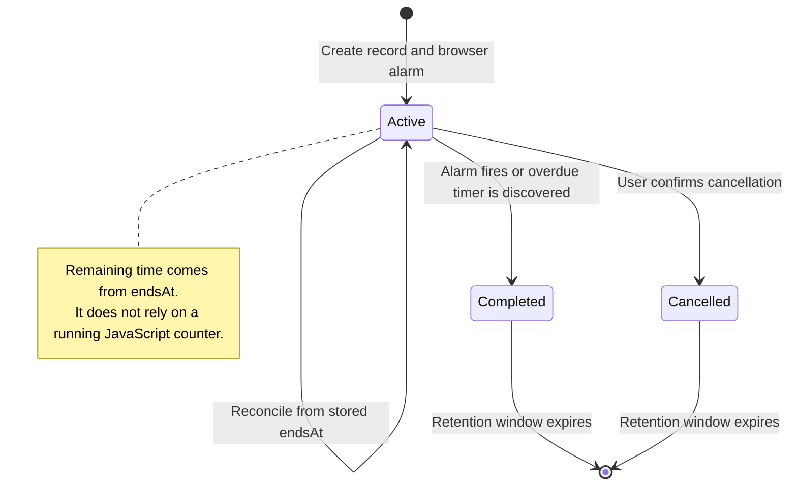
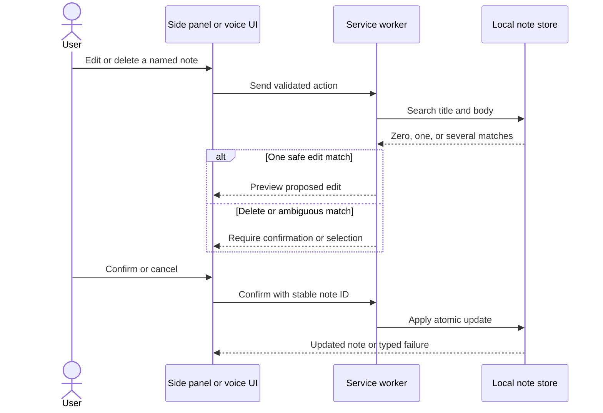

<!-- Summarises the intended experience, system boundaries, AI privacy flow, and timer lifecycle. -->

# Jeff The Chef diagrams

These diagrams describe the intended first-release behaviour. They should be
updated whenever implementation changes make them inaccurate.

## User experience

## System architecture

## AI personalisation and training boundary

Jeff does not train a model on user notes, transcripts, or questions. A future
personalisation feature may use explicitly selected preferences as request
context, but only after separate consent.

## Persistent timer lifecycle

## Note action safety

